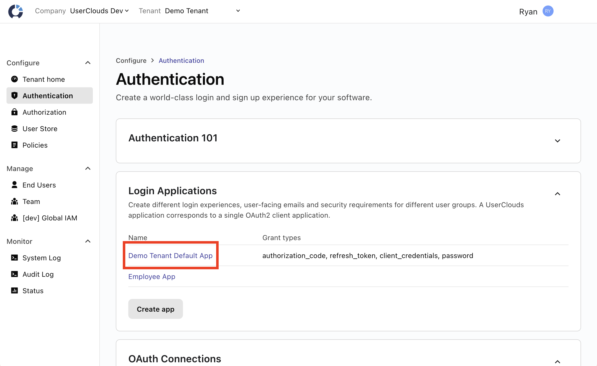
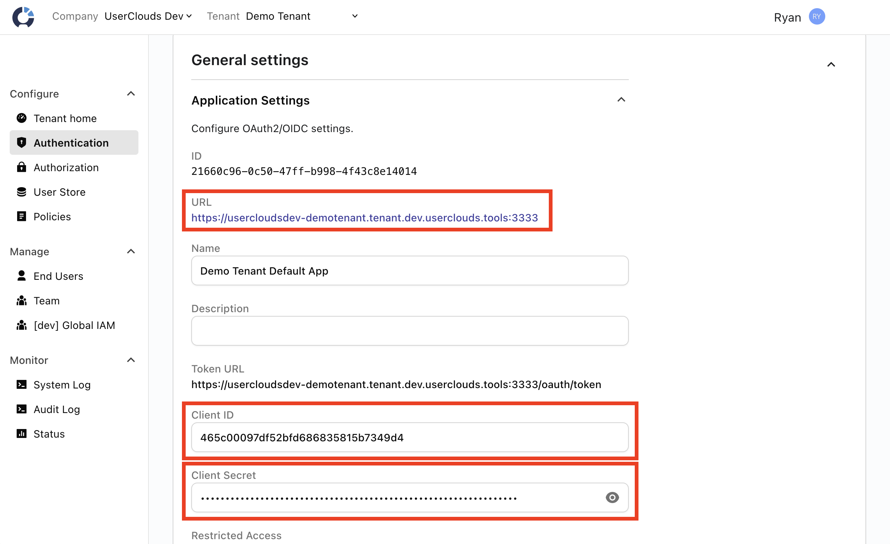

# ucconfig

ucconfig (UserClouds Config) enables declarative configuration of UserClouds
resources.

ucconfig is implemented as a usability layer on top of Terraform. It is not as
powerful or flexible as Terraform, but it avoids many of the common
frustrations of working with Terraform, such as manually writing configuration
or managing Terraform state. Since ucconfig generates Terraform configuration
and state, you can "eject" from ucconfig and manage UserClouds resources
directly with Terraform at any point.

## Getting Started

There are two easy ways to run `ucconfig`:

* Download a pre-packaged binary from the [Releases
  page](https://github.com/userclouds/ucconfig/releases). Note: on MacOS, you
  will likely need to [grant an exception to allow the binary to
  run](https://support.apple.com/guide/mac-help/apple-cant-check-app-for-malicious-software-mchleab3a043/mac).
* Run with Docker:
  ```
  docker run userclouds/ucconfig [ucconfig args described below...]
  ```
  `docker run` may require additional flags to share environment variables or
  files with the container. See example incantations in the [Usage](#usage)
  section.

For all commands, ucconfig requires `USERCLOUDS_TENANT_URL`,
`USERCLOUDS_CLIENT_ID`, and `USERCLOUDS_CLIENT_SECRET` environment variables to
be set. You can get these values from the UserClouds console by navigating to
the Authentication page, selecting the Default App, and copying values from the
Application Settings.




## Core ideas

With ucconfig, you write a *manifest* that describes the **complete** set of
desired UserClouds resources. For example, if you want to have a User Store
with three columns, two
[accessors](https://docs.userclouds.com/docs/accessors-read-apis), and one
[access policy](https://docs.userclouds.com/docs/access-policies-1), you would
write a manifest describing the properties of those six resources. Then, when
you apply that manifest:

* If a resource described in the manifest does not exist in your live
  UserClouds tenant, it will be created.
* If a resource exists in your live UserClouds tenant but does not appear in
  the manifest, it will be deleted.
* If a resource exists in both the live tenant and in your manifest, but its
  properties differ, the resource will be updated to match what is specified in
  the manifest.

For example, here is a minimal manifest describing a single User Store column for storing emails:

```yaml
resources:
  - uc_terraform_type: userstore_column
    manifest_id: email_col
    resource_uuids:
      __DEFAULT: 2c7a7c9b-90e8-47e4-8f6e-ec73bd2dec16
      mycompany-mytenant: 2c7a7c9b-90e8-47e4-8f6e-ec73bd2dec16
    attributes:
      name: email
      type: email
      index_type: none
      is_array: false
```

Let's break down the parts of this manifest entry:

* `uc_terraform_type` specifies the Terraform resource type to use. Refer to
  our [Terraform provider
  documentation](https://registry.terraform.io/providers/userclouds/userclouds/latest/docs)
  for a list of available resource types. In this case, we are specifying a
  [`userstore_column`](https://registry.terraform.io/providers/userclouds/userclouds/latest/docs/resources/userstore_column).
* The `manifest_id` is an arbitrary [Terraform
  identifier](https://developer.hashicorp.com/terraform/language/syntax/configuration#identifiers)
  (can only contain letters, digits, underscores, and hyphens) that allows you
  to reference this resource elsewhere in the manifest. For example, if you
  want to create an accessor that includes this column, you would specify
  `columns: ['@UC_MANIFEST_ID("email_col").id']` for that accessor.
* The `resource_uuids` specify the `id` attribute for each tenant that we might
  apply this configuration to. Since resource IDs might differ across
  environments you want to manage with ucconfig (e.g. you already created
  `email` columns by hand in your staging and production tenants, so they were
  created with different UUIDs), this allows ucconfig to determine which
  resource to modify when attributes are changed. `__DEFAULT` specifies the
  resource ID that will be used when creating this resource in a new tenant. For more information, see the [Resource IDs section](#resource-ids).
* The `attributes` specify the properties of the resource. These are passed
  directly to Terraform, so you can refer to the [provider
  documentation](https://registry.terraform.io/providers/userclouds/userclouds/latest/docs)
  for information about these values. For example, the attributes specified
  here are explained in the [userstore_column
  documentation](https://registry.terraform.io/providers/userclouds/userclouds/latest/docs/resources/userstore_column).


## Usage

Remember to set `USERCLOUDS_*` environment variables when running ucconfig, as
described above.

### Generating a manifest

Rather than needing to write your configuration by hand, the ucconfig
`gen-manifest` subcommand can generate a manifest file based on the existing
resources in a tenant.

`gen-manifest` takes a file path to write the manifest to:

```
ucconfig gen-manifest <manifest-path>
```

JSON and YAML are supported.

For example:

```
# Binary:
ucconfig gen-manifest output.yaml
# Docker:
docker run --rm -v "$PWD:$PWD" -w "$PWD" -i -e "USERCLOUDS_TENANT_URL=$USERCLOUDS_TENANT_URL" \
    -e "USERCLOUDS_CLIENT_ID=$USERCLOUDS_CLIENT_ID" -e "USERCLOUDS_CLIENT_SECRET=$USERCLOUDS_CLIENT_SECRET" \
    userclouds/ucconfig gen-manifest output.yaml
```

### Applying a manifest

A manifest is a complete description of a tenant's resources. You can use the
`apply` subcommand to create new resources described by a manifest, delete
resources that don't appear in the manifest, and update existing resources
whose properties differ from what the manifest describes.

`apply` takes the path to the manifest to apply:

```
ucconfig apply <manifest-path>
```

For example:

```
# Binary:
ucconfig apply manifest.yaml
# Docker:
docker run --rm -v "$PWD:$PWD" -w "$PWD" -i -e "USERCLOUDS_TENANT_URL=$USERCLOUDS_TENANT_URL" \
    -e "USERCLOUDS_CLIENT_ID=$USERCLOUDS_CLIENT_ID" -e "USERCLOUDS_CLIENT_SECRET=$USERCLOUDS_CLIENT_SECRET" \
    userclouds/ucconfig apply output.yaml
```

### Manifest IDs

Manifest IDs are arbitrary strings that identify an entry in the manifest. Manifest IDs must be valid [Terraform
identifiers](https://developer.hashicorp.com/terraform/language/syntax/configuration#identifiers),
i.e. they may only contain letters, digits, underscores, and hyphens.

Manifest IDs allow you to reference resources from elsewhere in the manifest using the `@UC_MANIFEST_ID` [function](#functions). For example,

```yaml
resources:
    # Define a column
    - uc_terraform_type: userstore_column
      manifest_id: email_col
      resource_uuids:
        # omitted for sample...
      attributes:
        # omitted for sample...
    # Define an accessor that accesses that column
    - uc_terraform_type: userstore_accessor
      manifest_id: demo_accessor
      resource_uuids:
        # omitted for sample...
      attributes:
        name: DemoAccessor
        columns:
            # Access the above "email" column
            - column: '@UC_MANIFEST_ID("email_col").id'
              transformer: '@UC_SYSTEM_OBJECT("transformer", "PassthroughUnchangedData")'
        access_policy: '@UC_SYSTEM_OBJECT("access_policy", "AllowAll")'
        purposes:
            - '@UC_SYSTEM_OBJECT("userstore_purpose", "operational")'
        selector_config:
            where_clause: '{id} = ANY(?)'
```

### Resource IDs

A ucconfig manifest entry can specify the resource UUIDs for each tenant that you intend to apply the manifest against:

```yaml
resources:
  - uc_terraform_type: userstore_column
    manifest_id: email_col
    resource_uuids:
      __DEFAULT: 2c7a7c9b-90e8-47e4-8f6e-ec73bd2dec16
      mycompany-dev: 59217a15-b63e-45e3-8a23-e1ea966cc42d
      mycompany-staging: bb5aa960-85cd-44b7-af81-5df432bdc8c6
      mycompany-prod: 2c7a7c9b-90e8-47e4-8f6e-ec73bd2dec16
    # ...
```

If a resource has the same UUID in all of your tenants (e.g. you used ucconfig
to create all resources in all your tenants), then specifying `__DEFAULT` is
sufficient, and you do not need to specify the ID for every tenant. ucconfig
will use the `__DEFAULT` key to match live tenant resources to manifest
entries.

However, if a resource exists with different UUIDs in different tenants (e.g.
you already manually created an `email` column in your staging and prod
tenants, so they ended up with different IDs), you should list each ID here to
guarantee that ucconfig will match the correct live resources. Listing each
tenant is not required -- ucconfig will try to match resources based on their
names, so if it sees an `email` column whose UUID did not match any other
manifest entries, it will match it to the `email` manifest entry -- but doing
so ensures that ucconfig will properly match resources even if their names are
changed.

When creating a new resource, ucconfig will create it with the `__DEFAULT` UUID.

### Functions

ucconfig supports a limited set of functions in manifests:

* `@UC_MANIFEST_ID(manifest_id)` references another resource by manifest ID.
  `@UC_MANIFEST_ID(manifest_id).id` (note the `.id` suffix) will retrieve the
  ID of the referenced resource. Example:
  ```yaml
  resources:
      # Define a column
      - uc_terraform_type: userstore_column
        manifest_id: email_col
        # omitted for sample...
      # Define an accessor that accesses that column
      - uc_terraform_type: userstore_accessor
        # ...
        attributes:
          columns:
              # Reference the above "email" column
              - column: '@UC_MANIFEST_ID("email_col").id'
          # ...
  ```
* `@UC_SYSTEM_OBJECT(resource_type, object_name)` retrieves the ID of a system
  object by name. For example, an accessor might use the built-in `AllowAll`
  access policy:
  ```yaml
  resources:
      - uc_terraform_type: userstore_accessor
        # ...
        attributes:
          access_policy: '@UC_SYSTEM_OBJECT("access_policy", "AllowAll")'
          # ...
  ```
